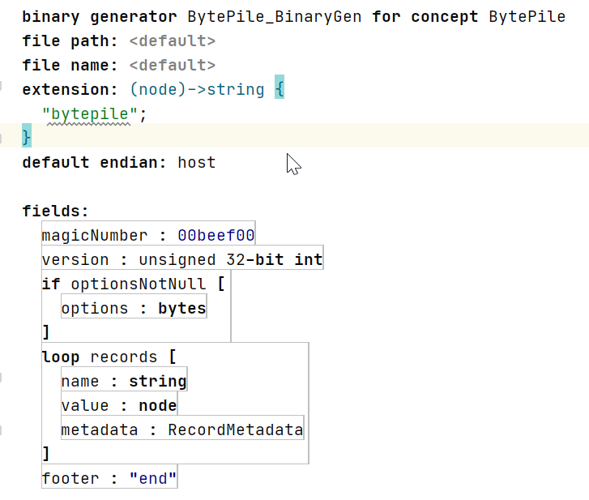

# BinaryGen

BinaryGen is a tool for [JetBrains MPS](https://www.jetbrains.com/mps/) to generate binary files as well as text files from your nodes.

# Using

This project defines a new aspect for your languages: `binaryGen`. It's like `textGen`, except this produces binary files instead of text files.

A binary generator consists of a series of fields, which may be numbers, strings, raw sets of bytes, etc
Each field allows you to specify its value via a function in the base language.
There are facilities for repitional and conditional field generation.
You can also define reusable components for generating binary files.

Once you define binary generators for your concepts, the solutions that make use of your language have to use the `BinaryGen.make` language.
Sadly, there's no way I know of to make the binary-generation process configurationless, like how textgen is.

# Implemented Features

* integers of various widths, endianess, and signededness
* strings, byte arrays, etc.
* repitional and conditional constructs
* reusable binary-generation components

# Planned Features

* a more pleasent editing experience
* previewing generated files
* switch-case construct
* if-else construct
* bit-field support

# Known Bugs

Some bugs in MPS that effect BinaryGen:

* [MPS-33217](https://youtrack.jetbrains.com/issue/MPS-33217)

# Special Thanks

* [coolya](https://github.com/coolya) for helping me with bundling the plugin
* The [MPS Slack](https://slack-mps.jetbrains.com/) for general support
